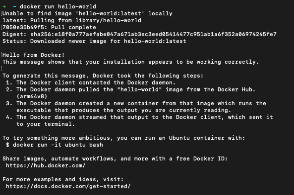
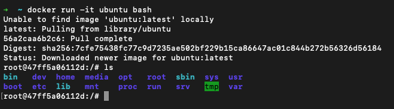
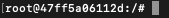

# Docker Tuto

### Docker run

Pour voir si l'installation a été correctement setup:
```
docker run hello-world
```



Pour lancer son propre container:
```
docker run container-name
```
Pour rendre un container interactif on utilise ```-it``` avec l'image qu'on veut lancer dans le container.
```
docker run -it ubuntu bash
```
Ici on a ajouté un argument suplémentaire qui dit qu'on veut lancer l'application ```bash``` dans l'image ubuntu. 

On obtient ce résultat. Docker va télécharger l'image ```unbuntu``` puis lancer l'application ```bash```.



Maintenant nous sommes l'utilisateur ```root``` et après le ```@``` on a l'id du container ici ```47ff5a06112d```.


